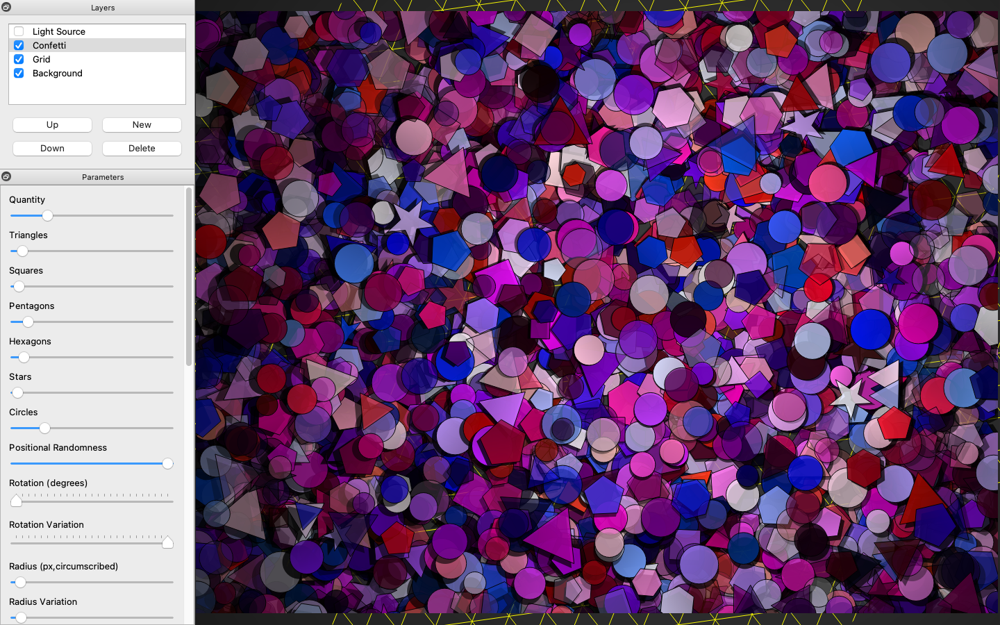

# Polyagnal Interactive Artistic Notions

Interactive "art" generator.

## Features

* many adjustable parameters
* shapes confetti with simple light source
* grid lines
* layers
* PNG output, and mediocre SVG output

## License

GNU GPL v3+

## Requirements

* GNU/Linux, or OS/X, or Windows.
* Python 3
* PyQt 5
* NumPy

## Installing

Terse installation instructions:

1. Install Python 3, probably 3.5 or newer should do it.

2. Install the corresponding version of PyQt 5.x, either directly, or using your operating system's package manager, or using pip: `pip3 install --user PyQt5`

3. Install NumPy, using pip: `pip3 install --user numpy`

4. Copy this project to a local directory and execute `pain.py`

